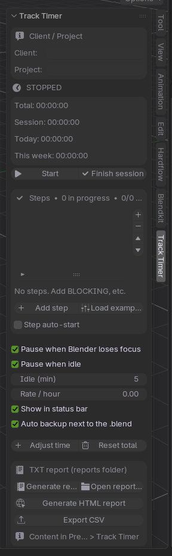
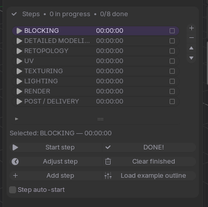
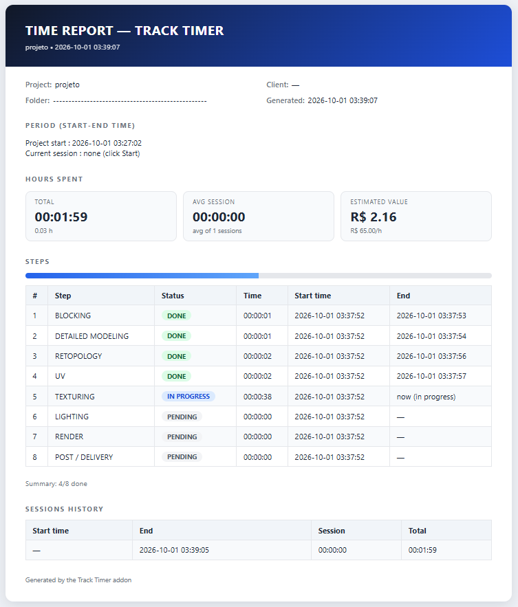
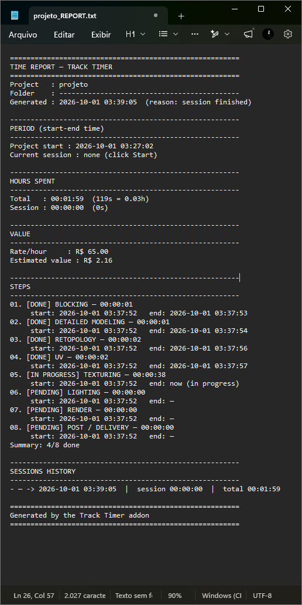
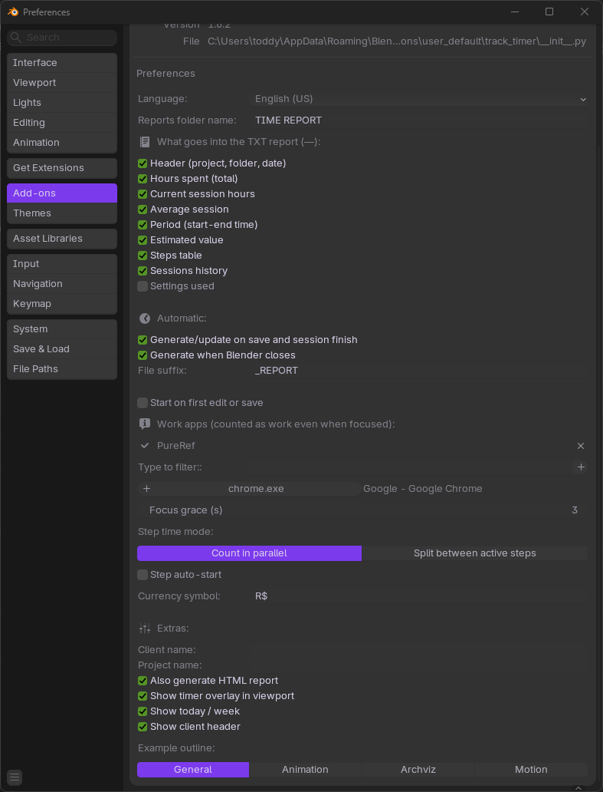

# Track Timer — Billable Work-Time Tracking for Blender

> Count real work hours inside Blender. Auto-pause on lost focus & idle, parallel steps/milestones, hourly-rate estimate and one-click TXT / HTML / CSV reports for clients.

**Version:** 1.6.2 · **Blender:** 4.2+ (extension) / 3.6–4.1 (legacy) · **License:** GPL-3.0-or-later

---

## Screenshots

| N-Panel timer | Steps in parallel | HTML client report |
|---|---|---|
|  |  |  |
| *Sidebar (N) > Track Timer: Start / Pause / Finish* | *Blocking, Modeling, UV… running at the same time* | *Printable HTML with hours, value and progress* |

| TXT report | Settings |
|---|---|
|  |  |
| *Auto-generated next to the .blend* | *Focus / idle / rate / overlay / language* |

---

## Why Track Timer

- ⏱️ **Honest hours** — counts only when you are really working
- ⏸️ **Auto-pause** — Blender loses focus (Alt+Tab, video, minimize) or no keyboard/mouse for X min
- 🧩 **Parallel steps** — Blocking / Modeling / UV / Texturing… several active at once, or split mode
- 💰 **Billable value** — hourly rate → estimated job value in the report
- 📄 **Client-ready reports** — TXT + printable HTML (Save as PDF) + CSVs, generated on save / finish / exit
- 🌍 **4 languages** — English, Português (BR), Español, Français
- 🛡️ **Crash-proof** — auto-backup `.tracktime.json` next to the `.blend`, Ctrl+Z can't eat your hours

## Install (2 min)

**Blender 4.2+ (recommended):**

1. Go to **Releases** and download `add-on-track-timer-v1.6.2.zip` (do NOT unzip, do NOT use the `Source code.zip`).
2. `Edit > Preferences > Get Extensions > ▾ menu > Install from Disk...` > select the zip.
3. Enable `Track Timer`, press `N` in the 3D Viewport > tab **Track Timer**.

**Blender 3.6–4.1 (legacy):**

1. Download `track_timer_addon.py` from the repo.
2. `Edit > Preferences > Add-ons > ▾ > Install from Disk...` > select the `.py` > enable.

## Quick start

1. Save your `.blend`.
2. N-panel > **Add step** or **Load example outline**.
3. Click **Start**. Work. **Pause** for coffee, **Finish session** to log.
4. `TIME REPORT/` folder appears next to the `.blend` with TXT + HTML + CSVs.

## Reports

```
<project>_REPORT.txt   human-readable log (hours, period, steps, sessions, settings)
<project>_REPORT.html  printable client version (Print / Save as PDF button)
<project>.tracktime.csv    sessions history
<project>.milestones.csv   steps table
<project>.tracktime.json   machine backup (auto-saved)
```

## Settings that matter

- `Pause when Blender loses focus` + `Focus grace (s)` — tolerates quick Alt+Tab
- `Pause when idle` + `Idle (min)` — coffee-break detection (Windows full, Linux/Mac best-effort)
- `Allowed apps` — PureRef / Photoshop still count as work when focused (need configuration on add-on menu)
- `Rate / hour` + `Currency symbol` — client estimate
- `Show timer overlay` / `Show today-week` / `Client + Project` header

Build the zip:

```powershell
powershell -File build_dist.ps1
```

## License

GPL-3.0-or-later — see [LICENSE](LICENSE). You can sell work made with it and you can sell the add-on itself, but you must ship the source under the same license.

Made by **oToddy.mp4**
